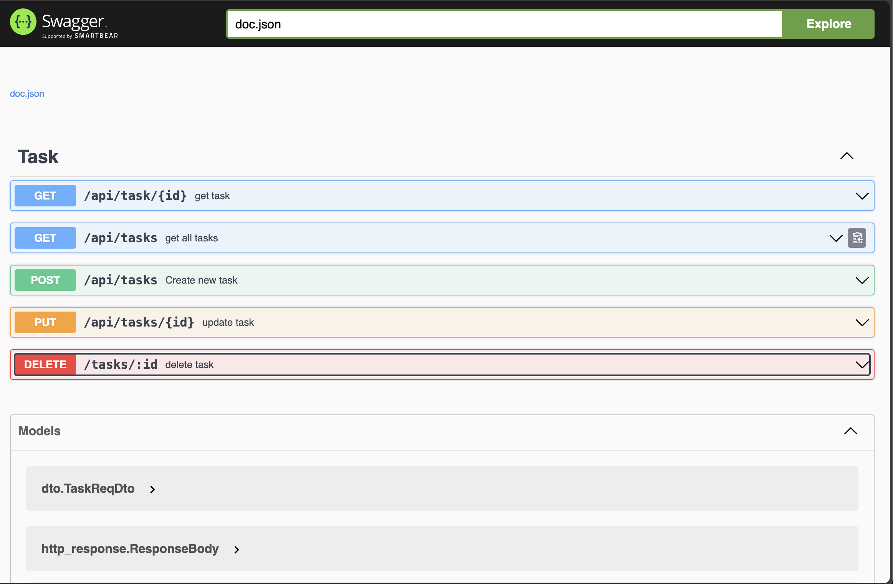

# Go-example
## Introduction 
Build up web restful api for task.
API provides Get all tasks, Get specific task, create task, update task, delete task. Using Postgres as relation database to store task data.


## What 
### Library 
- gin
- sqlx
- viper
- testify
- swaggo
- jaeger
- go-sqlmock
- mock
- mockgen
- go-migrate

### Infra
- Docker / docker-compose
- Postgesql
- prometheus
- node_exporter
- grafana
- jaeger

### API Design
Following the api detail below:
- Get all task api:
    - path: /api/tasks?cursor=${cursor}&limit=${limit}
    - method: "GET"
    - description: get all tasks from task table
    - request: 
        ```json
        ```
    - response: 
        ```json
        {
            "status": "success",
            "message": "get tasks successfully",
            "data": {
                "tasks":[{"id":1,"name":"task1","status":0,"created_at":"2024-02-03T05:39:50.778131Z","updated_at":"2024-02-03T05:39:50.778131Z"}],
                "next_cursor": "",
            }
        }   
        ```
- Get task api:
    - path: /api/task/:id
    - method: "GET"
    - description: get specific task from task table
        - request: 
        ```json
        ```
    - response: 
        ```json
        {
            "status": "success",
            "message": "get task successfully",
            "data": {"id":1,"name":"task1","status":0,"created_at":"2024-02-03T05:39:50.778131Z","updated_at":"2024-02-03T05:39:50.778131Z"}
        }   
        ```
- Create task api:
    - path: /api/task/:id
    - method: "POST"
    - description: create task in task table
    - request: 
        ```json
        {
            "name": "task1",
            "status": 0,
        }
        ```
    - response: 
        ```json
        {
            "status": "success",
            "message": "create task successfully",
            "data": {"id":1,"name":"task1","status":0,"created_at":"2024-02-03T05:39:50.778131Z","updated_at":"2024-02-03T05:39:50.778131Z"}
        }   
        ```
- Update task api:
    - path: /api/task/:id
    - method: "PUT"
    - description: update specific task from task table
    - request: 
        ```json
        {
            "name": "task1",
            "status": 0
        }   
        ```
    - response: 
        ```json
        {
            "status": "success",
            "message": "update task successfully",
            "data": {"id":1,"name":"task1","status":0,"created_at":"2024-02-03T05:39:50.778131Z","updated_at":"2024-02-03T05:39:50.778131Z"}
        }   
        ```
- Delete task api:
    - path: /api/task/:id
    - method: "DELETE"
    - description: delete specific task from task table
    - request: 
        ```json
        ```
    - response: 
        ```json
        {
            "status": "success",
            "message": "delete task successfully"
        }   
        ```


### Database design
Use migrate to migrate database data

| id | name    | status | created_at             | updated_at             |
|----|---------|--------|------------------------|------------------------|
| 1  | Task 1  | 0      | 2022-01-30T12:00:00Z   | 2022-01-30T12:00:00Z   |
| 2  | Task 2  | 1      | 2022-01-31T12:00:00Z   | 2022-01-31T12:00:00Z   |
| 3  | Task 3  | 0      | 2022-02-01T12:00:00Z   | 2022-02-01T12:00:00Z   |

## Usage
- Service entrypoint: cmd/api/main.go
- Service config: /config
- Service Relative pkg file: /pkg
- Service Internal api file: /internal
- Docker file: /docker
- Migration SQL file: /migrations
- Log file: /assets
- Package binary application path: /bin
- Environment variable: 
```sh
HOST="localhost"
PORT="9000"
DEBUG=false

POSTGRES_HOST=localhost
POSTGRES_USER=postgres
POSTGRES_PASSWORD=postgres
POSTGRES_DATABASE=db
SSL_MODE=true

JAEGER_HOST= "http://localhost:14268/api/traces"
```


### CLI
Install go relative lib 
```sh
go mod tidy
```

Start docker-compose containers
```sh
make docker-up 
```

Shutdown docker-compose containers
```sh
make docker-down
```

DB migration for postgres
```sh
make migrate-up
# migrate-create
# make migrate-down
# make migrate-force V=
```
Run restful server
```sh
make run-api
```

Linter code
```sh
make linter
```

Unit test
```sh
make test
# make mock -> generate mock file
```

Docker build
```sh
make docker-build
docker run -d -p 9000:9000 go-example:deploy
```
### Run
```sh
go mod tidy
make docker-up 
make migrate-up
make run-api
```

Swagger: http://localhost:9000/swagger/index.html



## Monitor 
### Prometheus
Metrics for monitoring server

Host: http://localhost:9090


### Grafana
Dashboard for visualizing metrics

Host: http://localhost:3001


### Jaeger 
Tracing service

Host: http://localhost:16686
